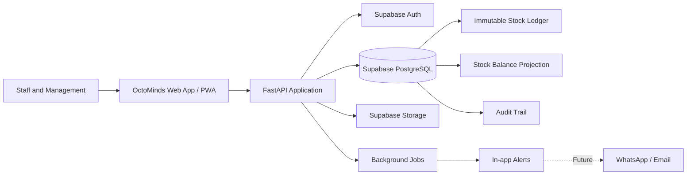
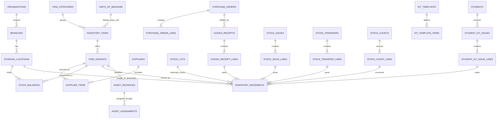
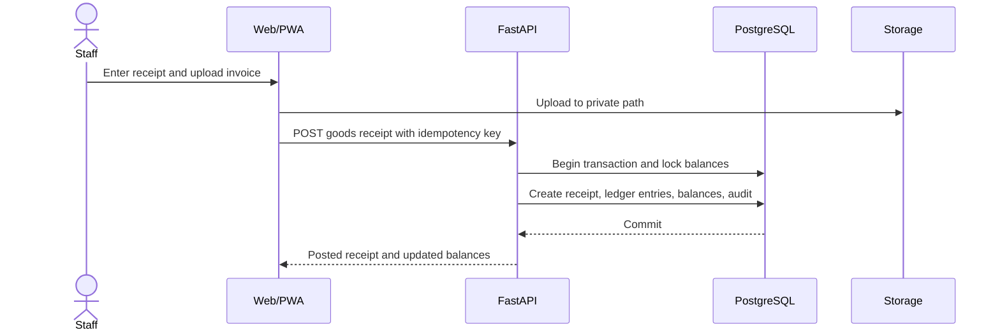
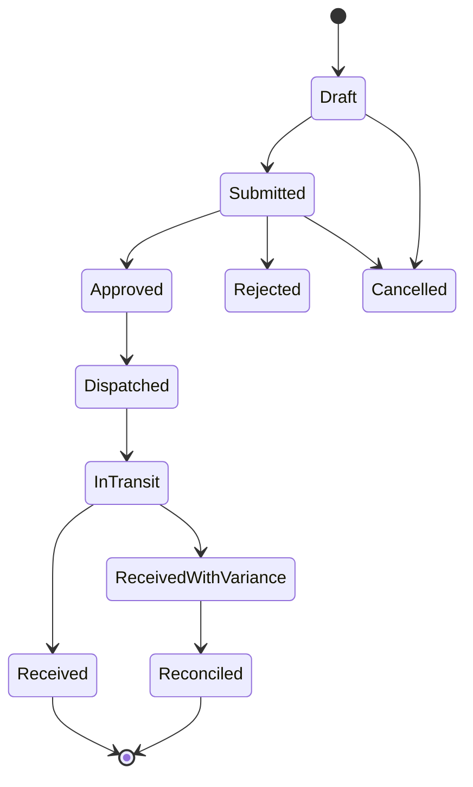

# OctoMinds Inventory Module

## System Design and Architecture

**Status:** Proposed implementation baseline  
**Platform:** OctoMinds Web Application and PWA  
**Technology alignment:** HTML/CSS/JavaScript, FastAPI, Supabase PostgreSQL/Auth/Storage, Render  
**Primary users:** Super Admin, Management, Branch Admin, Accountant, Teacher, Storekeeper, Parent

---

## 1. Executive Summary

The OctoMinds Inventory Module will provide centralized, branch-aware control of consumables, learning materials, student kits, uniforms, books, classroom equipment, and reusable assets.

The core design is an **immutable stock ledger**. Every receipt, issue, return, transfer, adjustment, student-kit distribution, or reversal creates a permanent movement record. The system maintains a fast stock-balance projection for day-to-day screens and reports while preserving the ledger as the auditable source of truth.

The module will begin as a well-isolated domain inside the existing FastAPI application. This keeps deployment and operations simple for the initial releases while preserving clear boundaries so inventory can be separated into its own service later if scale requires it.

### Architecture decisions

- Stock is managed by **branch and storage location**, not as one global number.
- Posted transactions are never edited or deleted; corrections use controlled reversals.
- Stock-affecting operations are committed atomically in PostgreSQL.
- Negative stock is blocked by default.
- Role and branch permissions are enforced in both the API and database.
- Files remain private and are accessed through short-lived signed URLs.
- The PWA may save drafts offline, but final stock posting requires the server.
- All writes support idempotency to prevent duplicate stock movements.

---

## 2. Objectives

### Business objectives

- Provide accurate, real-time branch-wise stock visibility.
- Reduce shortages using minimum-stock and reorder alerts.
- Track who received materials, when, in what quantity, and for what purpose.
- Control transfers between Head Office and branches.
- Track student-kit distribution against each student.
- Maintain purchasing, receipt, usage, wastage, and valuation history.
- Give management reliable reports without manual spreadsheets.

### Technical objectives

- Preserve a complete and tamper-resistant inventory history.
- Prevent overselling, duplicate posting, and conflicting updates.
- Keep inventory data isolated by organization, branch, and role.
- Support mobile-first workflows for teachers and branch teams.
- Remain maintainable within the current application architecture.
- Provide a safe path for future barcode, vendor, accounting, and procurement integrations.

### Initial non-goals

- Full accounting or general-ledger replacement.
- Vendor payment processing.
- Advanced demand forecasting or automated purchasing.
- RFID infrastructure.
- Public e-commerce fulfilment.

These can be added later through defined integration points.

---

## 3. Functional Scope

The module covers:

- Inventory categories and item catalogue.
- Units of measure and item variants.
- Branch stores, classrooms, departments, and storage locations.
- Suppliers and supplier-item relationships.
- Purchase orders and goods receipts.
- Stock receipts, issues, returns, transfers, and adjustments.
- Reorder levels and low-stock alerts.
- Physical stock counts and reconciliation.
- Student-kit definition and distribution.
- Lot, batch, expiry, and serial tracking where required.
- Reusable asset assignment and return.
- Supporting invoices, delivery notes, and item images.
- Operational and management reports.
- Complete authorization, audit, and activity history.

---

## 4. System Context



### Runtime responsibilities

| Layer | Responsibility |
|---|---|
| Web/PWA | Catalogue browsing, forms, barcode input, drafts, role-aware navigation, responsive workflows |
| FastAPI | Authentication, authorization, validation, workflow rules, transaction orchestration, reporting APIs |
| PostgreSQL | Source-of-truth records, row locks, constraints, ledger, projections, RLS, transactional integrity |
| Supabase Auth | User identity and access token issuance |
| Supabase Storage | Private item images, invoices, receipts, and generated reports |
| Background jobs | Alerts, scheduled summaries, export generation, reconciliation checks |
| Render | Combined application hosting and scheduled/worker execution |

### Recommended backend boundary

```text
api/inventory/
├── router.py          # HTTP routes only
├── schemas.py         # Request and response models
├── service.py         # Use cases and transaction orchestration
├── repository.py      # Database access
├── permissions.py     # Capability and branch checks
├── reports.py         # Reporting queries and exports
├── events.py          # Domain events and outbox records
└── errors.py          # Stable inventory error codes
```

This domain boundary prevents inventory rules from leaking into route handlers or unrelated modules.

---

## 5. Domain Model

### Supported inventory types

| Type | Example | Tracking behavior |
|---|---|---|
| Consumable | Paper, paint, cleaning liquid | Quantity by location |
| Reusable item | Toys, teaching aids | Quantity, condition, assignment history |
| Variant item | Uniform by size, bottle by colour | Separate variant SKU and balance |
| Lot-controlled item | Food, medicine, supplies with expiry | Lot number, manufacture date, expiry |
| Serialized asset | Laptop, projector, furniture | Unique asset tag and lifecycle |
| Student-kit component | Book set, bag, uniform | Issue linked to student and kit |

### Core domain rules

1. Every stocked variant has one base unit of measure.
2. All stock movements are stored in the base unit.
3. Posted movements are immutable.
4. Incorrect postings are corrected using reversal movements and a reason.
5. Available quantity cannot fall below zero unless a future exception policy explicitly permits it.
6. A balance is unique for organization, branch, location, variant, and optional lot.
7. Inter-branch transfer stock is unavailable to both operational stores while it is in transit.
8. The destination must acknowledge the quantity actually received.
9. Cost values are visible only to authorized financial and management roles.
10. Catalogue records with transaction history are archived, never hard-deleted.
11. Every write records actor, branch scope, source document, reason, and timestamp.

---

## 6. Data Architecture

### Entity relationship overview



### 6.1 Catalogue tables

#### `item_categories`

- `id`, `organization_id`, `parent_id`
- `name`, `code`, `description`
- `is_active`, timestamps

Supports nested categories such as Learning Materials → Books.

#### `units_of_measure`

- `id`, `code`, `name`, `decimal_scale`
- Examples: piece, box, packet, litre, kilogram

Optional conversion rules may be added per item, for example one box equals twelve pieces.

#### `inventory_items`

- `id`, `organization_id`, `category_id`
- `name`, `item_code`, `description`
- `inventory_type`
- `base_uom_id`
- `track_lots`, `track_expiry`, `track_serials`
- `valuation_method`
- `default_issue_price`
- `image_path`, `is_active`, timestamps

#### `item_variants`

- `id`, `item_id`, `sku`, `barcode`
- `variant_name`, `attributes_json`
- `is_active`, timestamps

Example: Uniform / Size 30 / SKU `UNI-30`.

### 6.2 Location and balance tables

#### `storage_locations`

- `id`, `organization_id`, `branch_id`
- `name`, `code`, `location_type`
- `parent_location_id`
- `is_issue_location`, `is_receipt_location`, `is_active`

Location types may include central store, branch store, classroom, office, daycare, quarantine, and in-transit.

#### `stock_lots`

- `id`, `variant_id`, `lot_number`
- `manufactured_on`, `expires_on`
- `supplier_id`, `receipt_line_id`

#### `stock_balances`

- `organization_id`, `branch_id`, `location_id`
- `variant_id`, optional `lot_id`
- `quantity_on_hand`
- `quantity_reserved`
- `quantity_available`
- `average_unit_cost`
- `version`, `updated_at`

This table is a transactional projection optimized for fast reads. It can be rebuilt from the ledger and must never be edited by a general CRUD endpoint.

### 6.3 Immutable stock ledger

#### `inventory_movements`

- `id`, `organization_id`, `branch_id`
- `movement_type`
- `variant_id`, optional `lot_id`
- `from_location_id`, `to_location_id`
- `quantity`
- `unit_cost`, `total_cost`
- `source_type`, `source_id`, `source_line_id`
- optional `reversal_of_movement_id`
- `idempotency_key`
- `occurred_at`, `posted_at`, `posted_by`
- `reason_code`, `notes`, request metadata

Supported movement types:

- `opening_balance`
- `receipt`
- `issue`
- `return_in`
- `return_out`
- `transfer_out`
- `transfer_in`
- `adjustment_gain`
- `adjustment_loss`
- `reservation`
- `reservation_release`
- `kit_issue`
- `asset_assignment`
- `reversal`

The ledger is the authoritative history. Balance values are derived state.

### 6.4 Procurement and receipt tables

- `suppliers`
- `supplier_items`
- `purchase_orders`
- `purchase_order_lines`
- `goods_receipts`
- `goods_receipt_lines`
- `inventory_documents`

Purchase orders use Draft → Submitted → Approved → Partially Received → Received → Closed/Cancelled states. Goods receipts capture invoice number, received quantities, accepted quantities, rejected quantities, costs, lots, and documents.

### 6.5 Issue, return, and transfer tables

- `stock_issues` and `stock_issue_lines`
- `stock_returns` and `stock_return_lines`
- `stock_transfers` and `stock_transfer_lines`

An issue recipient may be a staff member, teacher, classroom, department, student, daycare group, event, or other approved purpose.

### 6.6 Count and reconciliation tables

- `stock_counts`
- `stock_count_lines`
- `stock_adjustment_approvals`

Count lines store expected quantity, counted quantity, variance, reason, counter, verifier, and approval state.

### 6.7 Student-kit tables

- `kit_templates`
- `kit_template_items`
- `student_kit_issues`
- `student_kit_issue_lines`

A template can vary by academic year, program, class, admission type, and branch. Each issued component links to the student and its stock movement.

### 6.8 Serialized asset tables

- `asset_instances`
- `asset_assignments`
- `asset_maintenance_records`

An asset instance stores asset tag, serial number, purchase details, condition, warranty, location, custodian, and lifecycle status.

---

## 7. Transaction Architecture

### Atomic posting algorithm

Every command that affects stock must execute in one database transaction:

1. Validate the authenticated user and active organization membership.
2. Validate branch scope and required capability.
3. Validate the source document, line states, item status, and units.
4. Claim the idempotency key.
5. Lock affected `stock_balances` rows using `SELECT ... FOR UPDATE`.
6. Validate available quantity, lot, expiry, and destination rules.
7. Insert one or more immutable ledger movements.
8. Update the affected balance projections and weighted average cost.
9. Update the source document and line status.
10. Insert an audit and domain-event/outbox record.
11. Commit all changes together.

If any step fails, the entire transaction rolls back.

### Idempotency

All posting endpoints require an `Idempotency-Key` header. A repeated request with the same key and payload returns the original result. The same key with a different payload returns `409 IDEMPOTENCY_CONFLICT`.

This protects stock from duplicate mobile taps, slow connections, browser retries, and worker retries.

### Concurrency control

- Balance rows are locked in a stable order to reduce deadlocks.
- A unique balance key prevents duplicate projections.
- A `version` column supports optimistic checks on administrative updates.
- Available stock is revalidated while the row is locked.
- Deadlock or serialization failures may be retried a small, bounded number of times.

### Costing

The recommended initial valuation method is weighted average cost:

```text
new_average_cost =
  ((old_quantity × old_average_cost) + (received_quantity × receipt_unit_cost))
  ÷ (old_quantity + received_quantity)
```

Issue movements preserve the unit cost at posting time so historical reports remain stable.

---

## 8. Business Workflows

### 8.1 Stock receipt



Receipt states: Draft → Submitted → Posted. A posted receipt can only be reversed through an authorized correction workflow.

### 8.2 Stock issue

1. Select branch store and recipient/purpose.
2. Add item variants, lots, and quantities.
3. Validate available stock and permissions.
4. Submit or request approval when policy requires it.
5. Post issue movements and update balances.
6. Optionally capture recipient acknowledgment.

### 8.3 Branch transfer



On dispatch, stock moves from the source store to an in-transit location. On receipt, accepted stock moves from in-transit to the destination store. Shortage or damage is recorded as a variance requiring reconciliation.

### 8.4 Physical stock count

1. Create a count session for selected locations/categories.
2. Capture a frozen expected-balance snapshot.
3. Counters enter actual quantities, optionally using blind count mode.
4. A verifier reviews material variances.
5. Authorized approval creates adjustment movements.
6. The session is locked and retained for audit.

### 8.5 Student-kit distribution

1. Select student and applicable kit template.
2. Show issued, pending, replaced, and returned components.
3. Validate the issuing branch and stock availability.
4. Post kit-issue movements.
5. Store acknowledgment and optional receipt.
6. Expose distribution status to authorized parent-facing screens without cost data.

---

## 9. API Architecture

Base path: `/api/v1/inventory`

### Query endpoints

| Method | Endpoint | Purpose |
|---|---|---|
| GET | `/items` | Search and filter catalogue |
| GET | `/items/{item_id}` | Item, variants, suppliers, and policy |
| GET | `/balances` | Branch/location/variant balance view |
| GET | `/movements` | Filtered ledger history |
| GET | `/reorder-alerts` | Low/out-of-stock and recommended action |
| GET | `/transfers/{id}` | Transfer details and timeline |
| GET | `/students/{student_id}/kits` | Student-kit distribution status |
| GET | `/reports/{report_name}` | Authorized operational report |

### Command endpoints

| Method | Endpoint | Purpose |
|---|---|---|
| POST | `/items` | Create catalogue item |
| POST | `/receipts` | Create receipt draft |
| POST | `/receipts/{id}/post` | Atomically post receipt |
| POST | `/issues` | Create issue draft |
| POST | `/issues/{id}/post` | Atomically post issue |
| POST | `/transfers` | Create transfer |
| POST | `/transfers/{id}/approve` | Approve transfer |
| POST | `/transfers/{id}/dispatch` | Dispatch to in-transit stock |
| POST | `/transfers/{id}/receive` | Accept destination quantities |
| POST | `/counts` | Create physical-count session |
| POST | `/counts/{id}/reconcile` | Post approved variance |
| POST | `/student-kit-issues` | Distribute a student kit |
| POST | `/movements/{id}/reverse` | Controlled correction |

### API conventions

- UUID identifiers.
- UTC timestamps in ISO 8601 format.
- Decimal quantities and money serialized as strings.
- Cursor pagination for ledger and large lists.
- Stable machine-readable error codes.
- Request ID and idempotency key returned in responses.
- ETag or version checks for editable administrative records.
- No endpoint accepts `quantity_on_hand` as a directly editable field.

---

## 10. Authorization and Data Isolation

### Role capability matrix

| Capability | Super Admin | Management | Branch Admin / Storekeeper | Accountant | Teacher | Parent |
|---|:---:|:---:|:---:|:---:|:---:|:---:|
| View all branch stock | ✓ | ✓ | Assigned branch | Configurable | — | — |
| Manage catalogue | ✓ | ✓ | Limited | View | — | — |
| Receive stock | ✓ | ✓ | Assigned branch | Configurable | — | — |
| Issue stock | ✓ | ✓ | Assigned branch | View | Request or acknowledge | — |
| Approve transfer or adjustment | ✓ | ✓ | Policy-based | Configurable | — | — |
| View costs and valuation | ✓ | ✓ | Configurable | ✓ | — | — |
| Request classroom material | ✓ | ✓ | ✓ | — | ✓ | — |
| View student-kit status | ✓ | ✓ | Assigned branch | Configurable | Assigned students | Own child |
| Export reports | ✓ | ✓ | Branch reports | Financial reports | — | — |

### Enforcement layers

1. FastAPI verifies the Supabase access token.
2. The API loads active organization membership and branch assignments.
3. The use case checks the required capability and source/destination scope.
4. PostgreSQL Row Level Security restricts visible rows as defense in depth.
5. Sensitive fields such as cost are removed from unauthorized responses.

Recommended database helpers:

- `current_organization_id()`
- `is_active_member(organization_id)`
- `can_access_branch(branch_id)`
- `has_capability(capability_code, branch_id)`

Service-role credentials must remain server-side and must never be included in JavaScript or PWA bundles.

---

## 11. File and Document Security

Use private Supabase Storage buckets or private prefixes:

- `inventory-item-images`
- `inventory-documents`
- `inventory-exports`

Rules:

- Store database paths, not permanent public URLs.
- Generate short-lived signed download URLs after permission checks.
- Restrict file type and size.
- Scan or validate uploaded formats before processing.
- Namespace paths by organization and branch.
- Keep supplier invoices inaccessible to teachers and parents.
- Automatically expire generated exports and abandoned uploads.

---

## 12. PWA and Offline Behavior

The PWA may cache:

- Application shell.
- Item catalogue and images.
- Recently viewed read-only balance snapshots.
- Draft receipt, issue, count, and transfer forms.

It must not finalize stock movements offline because the server must check current balance, authorization, and document state.

When connectivity returns:

1. The PWA submits the saved draft with its original idempotency key.
2. The server revalidates current data.
3. Any conflict is shown for user resolution.
4. Only a successful server response marks the operation posted.

Cached balances must display their last synchronization time and must not be presented as live when offline.

---

## 13. Alerts and Notifications

Initial alerts:

- Low stock and out of stock.
- Expiring lots.
- Pending transfer approval or receipt.
- Overdue stock-count sessions.
- Unreturned reusable items.
- Incomplete student kits.
- Purchase order partially received or overdue.

Stock transactions write domain events to an outbox table in the same transaction. A background job processes those events after commit. Notification failure never rolls back a valid stock transaction.

In-app notifications are the first delivery channel. WhatsApp and email can be integrated later without changing inventory transaction logic.

---

## 14. Reporting Architecture

### Operational reports

- Current stock by branch, location, category, and item.
- Low-stock and out-of-stock list.
- Daily stock receipts and issues.
- Transfer status and pending acknowledgments.
- Stock movement history.
- Physical count variance.
- Student-kit pending and completed distribution.
- Asset assignment and return status.

### Management reports

- Inventory valuation by branch and category.
- Consumption trend by branch/classroom/department.
- Purchase and supplier performance.
- Slow-moving and non-moving stock.
- Wastage, loss, and adjustment analysis.
- Expiry risk.
- Branch comparison.

Small reports may run synchronously. Large exports should run as background jobs, write files to private storage, and return expiring signed links.

---

## 15. Performance and Indexing

Recommended indexes include:

- Unique `(organization_id, item_code)` on items.
- Unique `(organization_id, sku)` and filtered unique barcode on variants.
- Unique `(organization_id, branch_id, code)` on locations.
- Unique balance key across organization, branch, location, variant, and lot.
- `(organization_id, variant_id, posted_at DESC)` on movements.
- `(organization_id, branch_id, posted_at DESC)` on movements.
- `(source_type, source_id, source_line_id)` on movements.
- Unique `(organization_id, idempotency_key)` for posting requests.
- `(destination_branch_id, status, updated_at)` on transfers.
- `(branch_id, variant_id, is_active)` on reorder rules.

Use database views for standard balance and movement summaries. Materialized views may be introduced for heavy historical management reports once real usage demonstrates the need.

---

## 16. Audit and Observability

Every business operation records:

- User, role, organization, and branch context.
- Request and idempotency identifiers.
- Source document and resulting movement IDs.
- Previous and new workflow state.
- Reason code and optional notes.
- Timestamp and client metadata where appropriate.

Operational metrics should include:

- Posting success and failure rate.
- Transaction duration and database lock wait.
- Idempotent replay count.
- Negative-stock rejection count.
- Transfer turnaround time.
- Stock variance rate.
- Failed outbox or export jobs.
- Ledger-to-balance reconciliation status.

Logs must not contain access tokens, database credentials, PINs, or unnecessary child/parent personal information.

---

## 17. Failure Handling

| Scenario | System response |
|---|---|
| User taps Post twice | Same idempotency key returns the original result |
| Two users request the last units | Row lock allows one; the other receives insufficient-stock conflict |
| Transfer is partially received | Record accepted, damaged, and missing quantities; open reconciliation |
| Wrong receipt was posted | Authorized reversal creates compensating movements |
| User loses branch access mid-session | Server rejects the next command regardless of cached UI state |
| Upload succeeds but form is abandoned | Scheduled cleanup removes unreferenced private files |
| Notification delivery fails | Retry outbox job; do not roll back stock |
| Balance projection differs from ledger | Alert, block unsafe actions if material, and rebuild projection |
| Expired lot selected | Reject issue unless an explicit authorized exception exists |

---

## 18. Testing Strategy

### Unit tests

- Unit conversions and decimal precision.
- Weighted average costing.
- State transitions.
- Permission decisions.
- Reorder calculations.

### Database tests

- Constraints and uniqueness.
- Atomic posting and rollback.
- Concurrent issue attempts.
- Ledger-to-balance reconciliation.
- Row Level Security for each role and branch.

### API tests

- Authentication and authorization.
- Idempotency replay and conflict behavior.
- Validation and stable error codes.
- Pagination and filtering.
- Cost-field suppression.

### End-to-end tests

- Receipt to available balance.
- Issue and return.
- Full and partial branch transfer.
- Physical count with approved adjustment.
- Student-kit distribution.
- Mobile and offline draft recovery.

---

## 19. Release Plan

### Release 1 — Core Branch Inventory

- Categories, units, items, variants, and locations.
- Opening balances.
- Stock receipts, issues, returns, and movement history.
- Branch-wise balances.
- Low-stock rules and dashboard.
- Role and branch permissions.
- Audit trail and essential reports.

### Release 2 — Controlled Operations

- Suppliers and purchase orders.
- Goods receipt workflow and documents.
- Inter-branch transfers with acknowledgment.
- Physical counts and approvals.
- Student-kit templates and distribution.
- Background exports and in-app alerts.

### Release 3 — Advanced Control

- Lots, expiry, and serialized assets.
- Barcode/QR workflows.
- Advanced valuation and management analytics.
- Automated replenishment recommendations.
- WhatsApp/email alerts.
- Accounting and supplier integrations.

---

## 20. Recommended Implementation Order

1. Finalize inventory policies, roles, locations, units, and approval thresholds.
2. Add schema migrations, constraints, RLS helpers, and seed capabilities.
3. Implement catalogue and location administration.
4. Implement the ledger and atomic stock-posting service.
5. Add receipt, issue, return, and balance APIs.
6. Build responsive branch inventory screens.
7. Add audits, alerts, reconciliation checks, and essential reports.
8. Implement transfers and physical counts.
9. Implement student-kit distribution.
10. Add advanced tracking and integrations only after core operations are stable.

---

## 21. Proposed Defaults Pending Client Confirmation

- Negative stock: **Not allowed**.
- Valuation: **Weighted average cost**.
- Quantity storage: **Base unit with controlled conversions**.
- Branch access: **Restricted to assigned branches unless role grants all branches**.
- Transfer receipt: **Destination acknowledgment required**.
- Posted transaction correction: **Reversal only; no direct edit/delete**.
- Cost visibility: **Hidden from teacher and parent roles**.
- Offline behavior: **Draft capture only; server required to post**.
- Documents: **Private storage with signed access**.
- High-risk adjustments: **Management approval required**.

---

## 22. Definition of Done

The initial inventory release is production-ready when:

- Authorized users can manage the catalogue and branch locations.
- Receipts, issues, returns, and opening balances post atomically.
- Current stock always reconciles with the movement ledger.
- Duplicate and concurrent submissions cannot corrupt stock.
- Branch and role isolation is verified at API and database levels.
- All posted operations are auditable and reversible through controlled workflows.
- Low-stock alerts and agreed operational reports are available.
- Mobile layouts and offline drafts work reliably.
- Security, migration, rollback, backup, and restore tests pass.
- User acceptance testing and branch-team training are completed.

---

This document is the implementation baseline for the OctoMinds Inventory Module. Changes to stock policy, authorization, valuation, or transaction behavior should be recorded as architecture decisions before development proceeds.
